# Experiment Walkthrough: Proposal Advice (p) Condition

*2026-10-07T14:45:37Z by Showboat 0.6.1*
<!-- showboat-id: abaf681e-afad-42fc-b6e2-9e4c301ef264 -->

This walkthrough demonstrates the complete participant experience in the **proposal_advice (p)** condition of the writing experiment, using the **roomDoubleBooking** scenario. In this condition, participants receive directive AI advice (not copy-paste text) while composing an email.

## Step 1: Consent Page

The participant arrives at the study URL and sees the consent form. This page explains the study purpose, time commitment, compensation, and data handling.

```bash
rodney open "http://localhost:3000/study?username=walkthrough-user&condition=p&scenario=roomDoubleBooking&page=consent" && rodney sleep 2 && rodney screenshot walkthroughs/walkthrough-consent.png
```

```output
Writing Task
walkthroughs/walkthrough-consent.png
```

```bash {image}
walkthroughs/walkthrough-consent.png
```

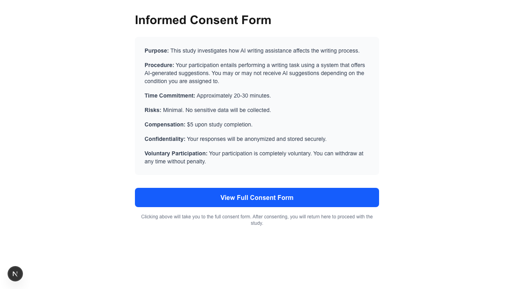

The consent page includes a button that launches an external Qualtrics consent form. After completing consent, the participant is redirected to the introduction page. (For this walkthrough, we navigate directly.)

## Step 2: Introduction Page

The participant sees an overview of the study structure: three steps (questionnaire, email writing task, follow-up questionnaire).

```bash
rodney open "http://localhost:3000/study?username=walkthrough-user&condition=p&scenario=roomDoubleBooking&page=intro" && rodney sleep 2 && rodney screenshot walkthroughs/walkthrough-intro.png
```

```output
Writing Task
walkthroughs/walkthrough-intro.png
```

```bash {image}
walkthroughs/walkthrough-intro.png
```

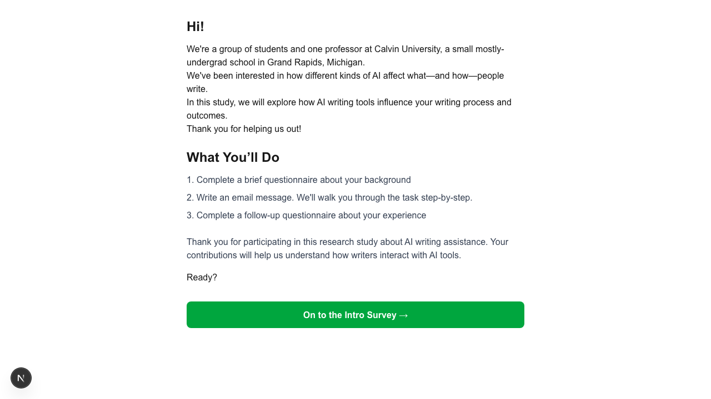

The participant clicks "Begin Study" to continue.

## Step 3: Intro Survey

A background questionnaire split into five pages, each with a **Next** button (and **Back** after the first page). Required questions must be answered before moving on. The pages are: demographics, email writing experience, AI writing tool usage, the Self-Efficacy for Writing Scale, and the Need for Cognition Scale (NCS-6).

```bash
rodney open "http://localhost:3000/study?username=walkthrough-user&condition=p&scenario=roomDoubleBooking&page=intro-survey" && rodney sleep 2 && rodney screenshot walkthroughs/walkthrough-survey-blank.png
```

```output
Writing Task
walkthroughs/walkthrough-survey-blank.png
```

```bash {image}
walkthroughs/walkthrough-survey-blank.png
```

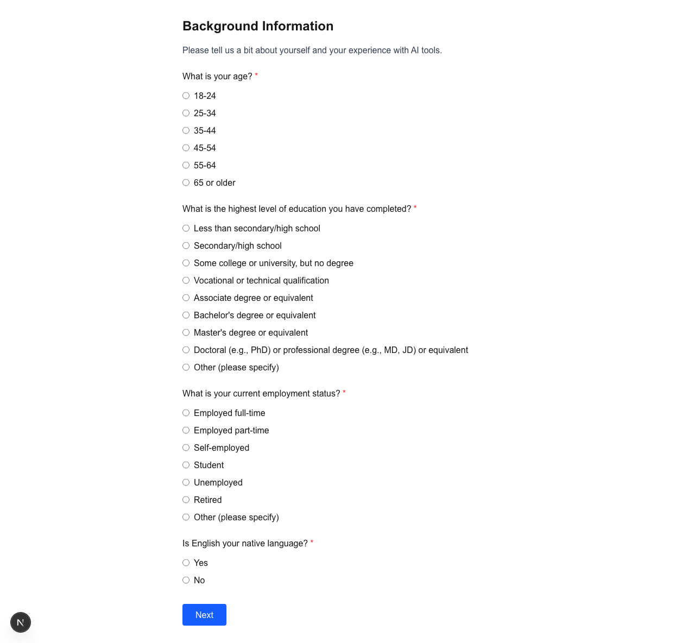

### Page 1: Demographics

Let's fill in the survey as a sample participant: a university student aged 18-24 whose native language is English.

```bash
rodney click 'input[name="age"][value="18-24"]' && rodney click 'input[name="education"][value="Some college or university, but no degree"]' && rodney click 'input[name="employment"][value="Student"]' && rodney click 'input[name="english_native"][value="Yes"]' && echo "Demographics filled"
```

```output
Clicked
Clicked
Clicked
Clicked
Demographics filled
```

```bash
rodney js "window.scrollTo(0, 0)" && rodney sleep 1 && rodney screenshot walkthroughs/walkthrough-survey-demographics.png
```

```output
null
walkthroughs/walkthrough-survey-demographics.png
```

```bash {image}
walkthroughs/walkthrough-survey-demographics.png
```

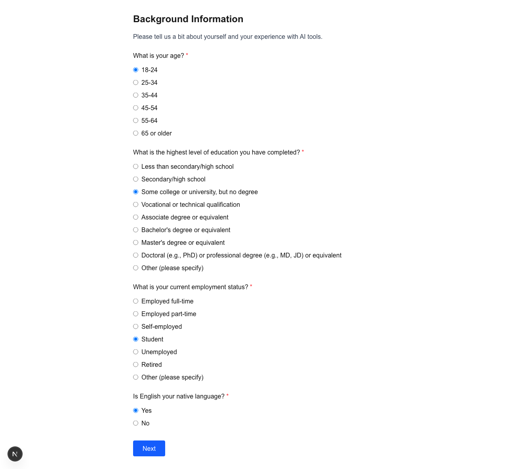

```bash
rodney click 'button[type="submit"]' && rodney sleep 1 && echo "Next page"
```

```output
Clicked
Next page
```

### Page 2: Email Writing Experience

The participant writes emails for school at least weekly and has 1-3 years of experience.

```bash
rodney click 'input[name="email_frequency"][value="At least once a week, but not every day"]' && rodney click 'input[name="email_experience_years"][value="1-3 years"]' && echo "Email writing experience filled"
```

```output
Clicked
Clicked
Email writing experience filled
```

```bash
rodney js "window.scrollTo(0, 0)" && rodney sleep 1 && rodney screenshot walkthroughs/walkthrough-survey-email.png
```

```output
null
walkthroughs/walkthrough-survey-email.png
```

```bash {image}
walkthroughs/walkthrough-survey-email.png
```

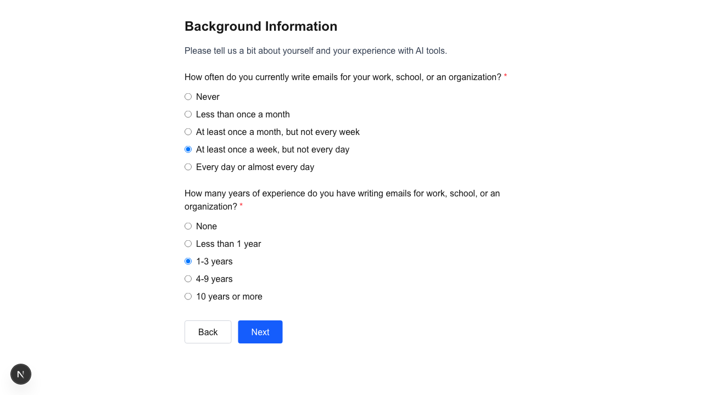

```bash
rodney click 'button[type="submit"]' && rodney sleep 1 && echo "Next page"
```

```output
Clicked
Next page
```

### Page 3: AI Writing Tool Usage

The participant uses AI writing tools monthly, for brainstorming and for revising their own text. Choosing **Other (please specify)** would show a required text box under that option; **I don't use AI for writing** clears the other selections.

```bash
rodney click 'input[name="ai_writing_frequency"][value="At least once a month, but not every week"]' && rodney click 'input[type="checkbox"][value="Brainstorming ideas"]' && rodney click 'input[type="checkbox"][value="Revising or editing text I wrote (including checking for grammar and spelling)"]' && echo "AI writing tool usage filled"
```

```output
Clicked
Clicked
Clicked
AI writing tool usage filled
```

```bash
rodney js "window.scrollTo(0, 0)" && rodney sleep 1 && rodney screenshot walkthroughs/walkthrough-survey-ai-usage.png
```

```output
null
walkthroughs/walkthrough-survey-ai-usage.png
```

```bash {image}
walkthroughs/walkthrough-survey-ai-usage.png
```

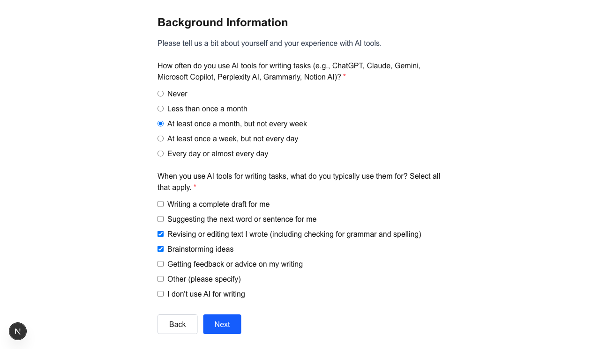

```bash
rodney click 'button[type="submit"]' && rodney sleep 1 && echo "Next page"
```

```output
Clicked
Next page
```

### Page 4: Self-Efficacy for Writing Scale

Nine statements rated from **Not at all confident** to **Extremely confident**.

```bash
rodney click 'input[name="writing_se_words"][value="Very confident"]' && rodney click 'input[name="writing_se_ideas"][value="Moderately confident"]' && rodney click 'input[name="writing_se_put_ideas"][value="Very confident"]' && rodney click 'input[name="writing_se_sentences"][value="Extremely confident"]' && rodney click 'input[name="writing_se_punctuation"][value="Very confident"]' && rodney click 'input[name="writing_se_spelling"][value="Very confident"]' && rodney click 'input[name="writing_se_concentrate"][value="Moderately confident"]' && rodney click 'input[name="writing_se_distractions"][value="Slightly confident"]' && rodney click 'input[name="writing_se_persist"][value="Moderately confident"]' && echo "Self-efficacy questions filled"
```

```output
Clicked
Clicked
Clicked
Clicked
Clicked
Clicked
Clicked
Clicked
Clicked
Self-efficacy questions filled
```

```bash
rodney js "window.scrollTo(0, 0)" && rodney sleep 1 && rodney screenshot walkthroughs/walkthrough-survey-self-efficacy-top.png
```

```output
null
walkthroughs/walkthrough-survey-self-efficacy-top.png
```

```bash {image}
walkthroughs/walkthrough-survey-self-efficacy-top.png
```


```bash
rodney js "window.scrollTo(0, document.body.scrollHeight)" && rodney sleep 1 && rodney screenshot walkthroughs/walkthrough-survey-self-efficacy-bottom.png
```

```output
null
walkthroughs/walkthrough-survey-self-efficacy-bottom.png
```

```bash {image}
walkthroughs/walkthrough-survey-self-efficacy-bottom.png
```

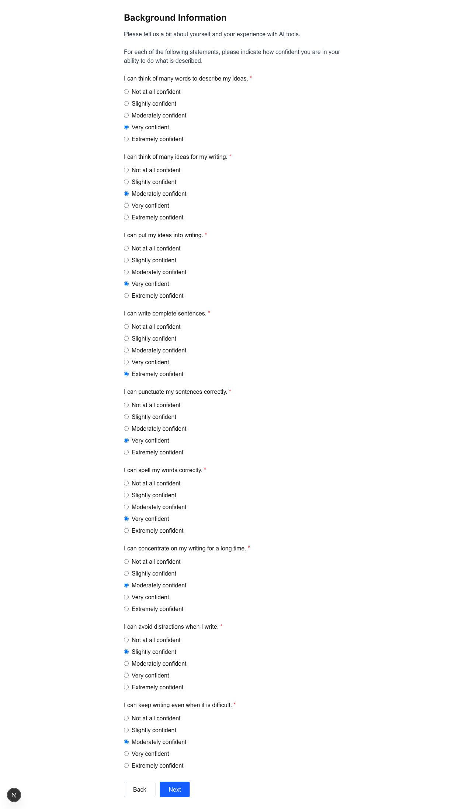

```bash
rodney click 'button[type="submit"]' && rodney sleep 1 && echo "Next page"
```

```output
Clicked
Next page
```

### Page 5: Need for Cognition Scale (NCS-6)

Six statements rated from **Extremely uncharacteristic of me** to **Extremely characteristic of me**.

```bash
rodney click 'input[name="ncs_1"][value="Somewhat characteristic of me"]' && rodney click 'input[name="ncs_2"][value="Somewhat characteristic of me"]' && rodney click 'input[name="ncs_3"][value="Somewhat uncharacteristic of me"]' && rodney click 'input[name="ncs_4"][value="Extremely uncharacteristic of me"]' && rodney click 'input[name="ncs_5"][value="Extremely characteristic of me"]' && rodney click 'input[name="ncs_6"][value="Uncertain"]' && echo "Need for Cognition questions filled"
```

```output
Clicked
Clicked
Clicked
Clicked
Clicked
Clicked
Need for Cognition questions filled
```

```bash
rodney js "window.scrollTo(0, 0)" && rodney sleep 1 && rodney screenshot walkthroughs/walkthrough-survey-ncs-top.png
```

```output
null
walkthroughs/walkthrough-survey-ncs-top.png
```

```bash {image}
walkthroughs/walkthrough-survey-ncs-top.png
```


```bash
rodney js "window.scrollTo(0, document.body.scrollHeight)" && rodney sleep 1 && rodney screenshot walkthroughs/walkthrough-survey-ncs-bottom.png
```

```output
null
walkthroughs/walkthrough-survey-ncs-bottom.png
```

```bash {image}
walkthroughs/walkthrough-survey-ncs-bottom.png
```

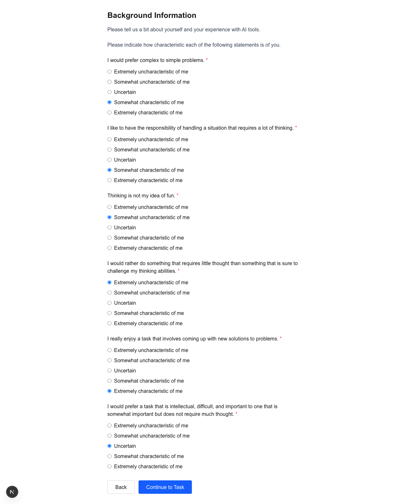

On the last page, the participant clicks "Continue to Task" to proceed.

```bash
rodney click 'button[type="submit"]' && rodney sleep 2 && rodney url
```

```output
Clicked
http://localhost:3000/study?username=walkthrough-user&condition=p&scenario=roomDoubleBooking&page=start-task
```

## Step 4: Task Instructions

The participant reads the scenario briefing. In the roomDoubleBooking scenario, they learn they need to email panelist Jaden Thompson about a room conflict, coordinating with colleague Sarah Martinez via chat. Key instructions include: review colleague's messages, ask follow-up questions, and compose a professional email. They're told they may see AI suggestions ("Advice for your next words").

```bash
rodney js "window.scrollTo(0, 0)" && rodney sleep 1 && rodney screenshot walkthroughs/walkthrough-task-instructions.png
```

```output
null
walkthroughs/walkthrough-task-instructions.png
```

```bash {image}
walkthroughs/walkthrough-task-instructions.png
```


```bash
rodney js "window.scrollTo(0, 500)" && rodney sleep 1 && rodney screenshot walkthroughs/walkthrough-task-instructions-2.png
```

```output
null
walkthroughs/walkthrough-task-instructions-2.png
```

```bash {image}
walkthroughs/walkthrough-task-instructions-2.png
```

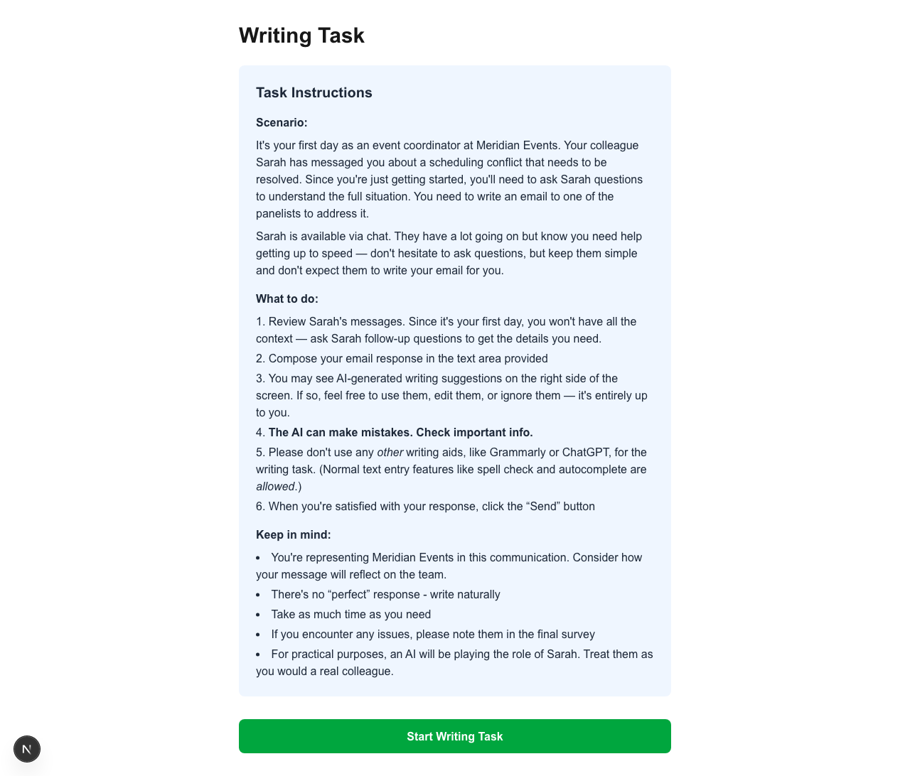

```bash
rodney js "window.scrollTo(0, document.body.scrollHeight)" && rodney sleep 1 && rodney screenshot walkthroughs/walkthrough-task-instructions-3.png
```

```output
null
walkthroughs/walkthrough-task-instructions-3.png
```

```bash {image}
walkthroughs/walkthrough-task-instructions-3.png
```


The participant clicks "Start Writing Task" to begin the main task.

```bash
rodney click "button" && rodney sleep 3 && rodney url
```

```output
Clicked
http://localhost:3000/study?username=walkthrough-user&condition=p&scenario=roomDoubleBooking&page=task
```

## Step 5: Main Writing Task

This is the core of the experiment. The screen has three areas:
- **Left**: Email composition area (To, Subject, Body fields)
- **Bottom-right**: Floating chat panel with simulated colleague Sarah Martinez
- **Right sidebar**: AI Writing Assistant panel showing directive advice

The colleague's initial messages appear automatically with typing animations.

```bash
rodney sleep 8 && rodney screenshot -w 1440 -h 900 walkthroughs/walkthrough-task-initial.png
```

```output
walkthroughs/walkthrough-task-initial.png
```

```bash {image}
walkthroughs/walkthrough-task-initial.png
```

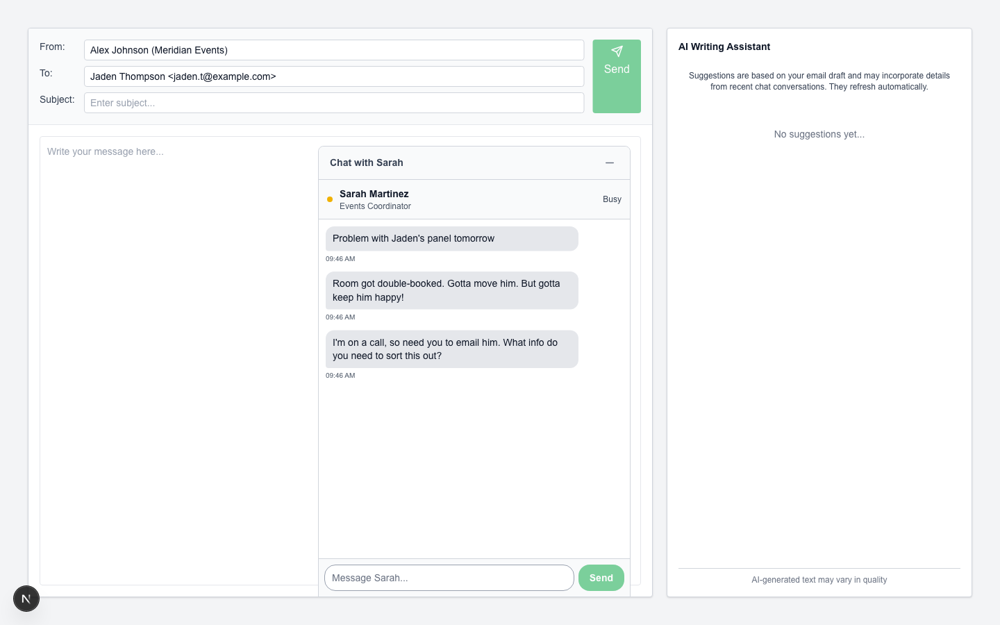

```bash
rodney sleep 10 && rodney screenshot -w 1440 -h 900 walkthroughs/walkthrough-task-messages.png
```

```output
walkthroughs/walkthrough-task-messages.png
```

```bash {image}
walkthroughs/walkthrough-task-messages.png
```


The colleague (Sarah Martinez) sends her initial messages automatically:
1. "Problem with Jaden's panel tomorrow"
2. "Room got double-booked. Gotta move him. But gotta keep him happy!"
3. "I'm on a call, so need you to email him. What info do you need to sort this out?"

The chat panel is a floating window at the bottom-right. The colleague is intentionally non-proactive — she only answers questions when asked, simulating a busy coworker.

### Chatting with the Colleague

The participant asks Sarah questions to gather information needed for the email. Sarah is intentionally non-proactive — she only answers what's asked, simulating a busy coworker.

```bash
rodney input 'input[placeholder="Message Sarah..."]' "What room is Jaden being moved to? And what time is his panel?" && rodney click 'form button[type="submit"]' && echo "Message sent"
```

```output
Typed: What room is Jaden being moved to? And what time is his panel?
Clicked
Message sent
```

```bash
rodney sleep 8 && rodney screenshot -w 1440 -h 900 walkthroughs/walkthrough-task-chat-response.png
```

```output
walkthroughs/walkthrough-task-chat-response.png
```

```bash {image}
walkthroughs/walkthrough-task-chat-response.png
```

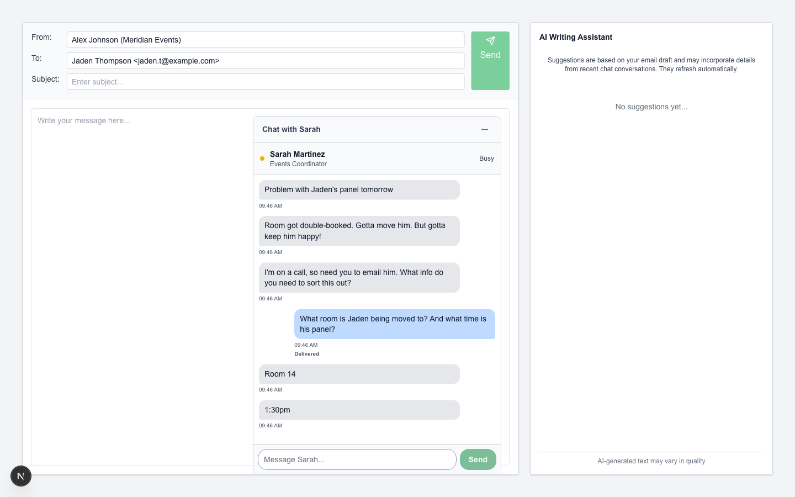

```bash
rodney js "document.querySelector('.flex-1.overflow-y-auto.bg-white').innerText"
```

```output
Problem with Jaden's panel tomorrow
09:46 AM
Room got double-booked. Gotta move him. But gotta keep him happy!
09:46 AM
I'm on a call, so need you to email him. What info do you need to sort this out?
09:46 AM
What room is Jaden being moved to? And what time is his panel?
09:46 AM
Delivered
Room 14
09:46 AM
1:30pm
09:46 AM
```

### Composing the Email

With information from Sarah, the participant begins composing their email. The AI panel requires at least 25 characters before generating suggestions.

```bash
rodney input "#subject-field" "Important Update: Panel Room Change" && echo "Subject entered"
```

```output
Typed: Important Update: Panel Room Change
Subject entered
```

```bash
rodney focus "textarea" && rodney input "textarea" "Dear Jaden,

I hope this message finds you well. I'm writing to let you know about a change to your panel room for tomorrow. Due to a scheduling conflict, we've needed to move your session from the original room to Room 14. The new time slot will be 1:30 PM, which gives us a comfortable setup window.

I understand this is a last-minute change and I apologize for any inconvenience." && echo "Email body entered"
```

```output
Focused
Typed: Dear Jaden,

I hope this message finds you well. I'm writing to let you know about a change to your panel room for tomorrow. Due to a scheduling conflict, we've needed to move your session from the original room to Room 14. The new time slot will be 1:30 PM, which gives us a comfortable setup window.

I understand this is a last-minute change and I apologize for any inconvenience.
Email body entered
```

```bash
rodney screenshot -w 1440 -h 900 walkthroughs/walkthrough-task-email-draft.png
```

```output
walkthroughs/walkthrough-task-email-draft.png
```

```bash {image}
walkthroughs/walkthrough-task-email-draft.png
```

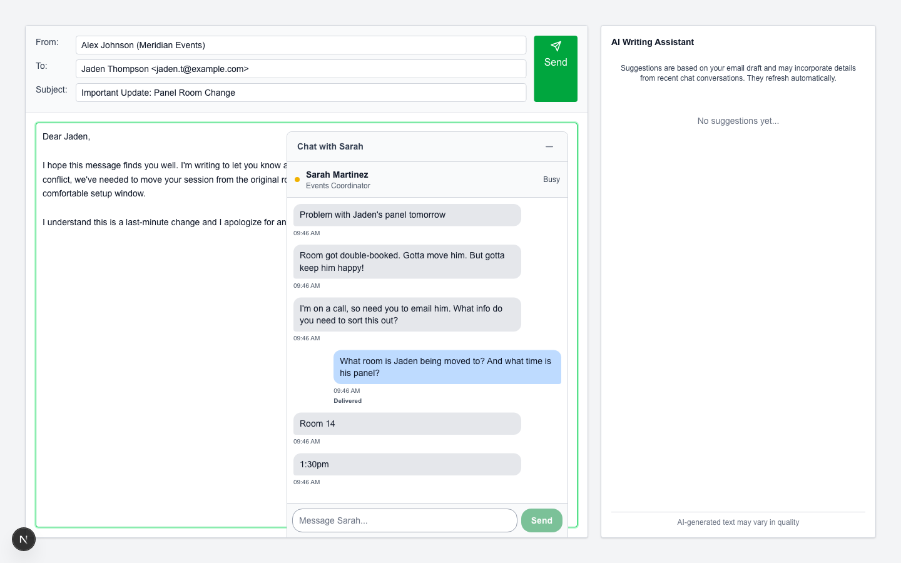

### AI Suggestions Panel (proposal_advice mode)

After the participant types enough text (25+ characters), the AI panel begins generating directive advice. In the **p** condition, the AI provides 2-3 pieces of advice about what to write next — not copy-paste text, but thinking prompts like "Consider acknowledging the inconvenience" or "Emphasize the new arrangement benefits." Suggestions auto-refresh every 15 seconds.

```bash
rodney sleep 18 && rodney screenshot -w 1440 -h 900 walkthroughs/walkthrough-task-ai-suggestions.png
```

```output
walkthroughs/walkthrough-task-ai-suggestions.png
```

```bash {image}
walkthroughs/walkthrough-task-ai-suggestions.png
```

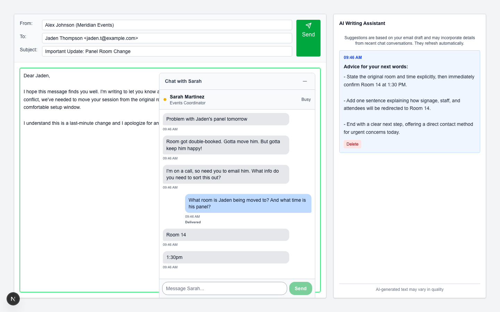

```bash
rodney text "textarea"
```

```output
Dear Jaden,

I hope this message finds you well. I'm writing to let you know about a change to your panel room for tomorrow. Due to a scheduling conflict, we've needed to move your session from the original room to Room 14. The new time slot will be 1:30 PM, which gives us a comfortable setup window.

I understand this is a last-minute change and I apologize for any inconvenience.
```

```bash
rodney js "document.querySelector('h3').parentElement.innerText"
```

```output
AI Writing Assistant
Suggestions are based on your email draft and may incorporate details from recent chat conversations. They refresh automatically.
09:46 AM
Advice for your next words:
- State the original room and time explicitly, then immediately confirm Room 14 at 1:30 PM.

- Add one sentence explaining how signage, staff, and attendees will be redirected to Room 14.

- End with a clear next step, offering a direct contact method for urgent concerns today.
Delete
AI-generated text may vary in quality
```

The AI panel shows directive advice: it tells the participant *what to think about* rather than giving them words to copy. This is the key distinction of the **p** (proposal_advice) condition compared to other conditions that provide copy-paste text.

Now the participant finishes their email and clicks Send.

```bash
rodney js "document.querySelector('button[aria-label=\"Send email\"]').click()" && rodney sleep 3 && rodney url
```

```output
null
http://localhost:3000/study?username=walkthrough-user&condition=p&scenario=roomDoubleBooking&page=debrief
```

## Step 6: Task Complete

After sending the email, the participant sees a short confirmation page and clicks "Continue to Post-Task Survey".

```bash
rodney screenshot -w 1440 -h 900 walkthroughs/walkthrough-task-complete.png
```

```output
walkthroughs/walkthrough-task-complete.png
```

```bash {image}
walkthroughs/walkthrough-task-complete.png
```

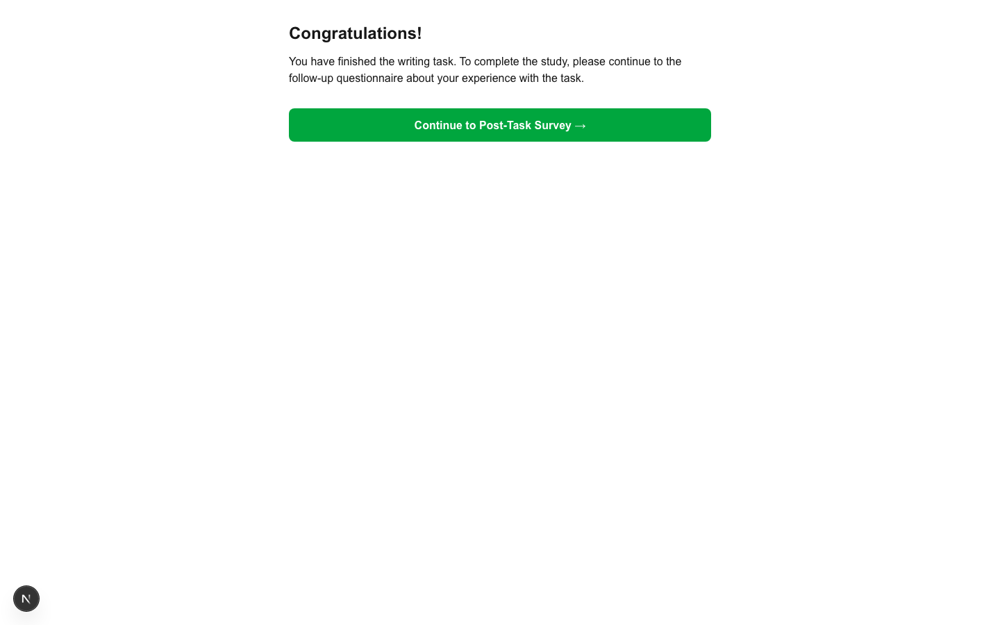

```bash
rodney click "button" && rodney sleep 2 && rodney url
```

```output
Clicked
http://localhost:3000/study?username=walkthrough-user&condition=p&scenario=roomDoubleBooking&page=post-task-survey
```

## Step 7: Post-Task Survey

The participant then completes a post-task questionnaire. It includes NASA TLX-style workload questions (mental effort, time pressure, frustration) plus AI-specific questions about whether suggestions were helpful, easy to understand, and whether the participant felt pressured to use them.

```bash
rodney screenshot -w 1440 -h 900 walkthroughs/walkthrough-post-survey-top.png
```

```output
walkthroughs/walkthrough-post-survey-top.png
```

```bash {image}
walkthroughs/walkthrough-post-survey-top.png
```


```bash
rodney js "window.scrollTo(0, 600)" && rodney sleep 1 && rodney screenshot -w 1440 -h 900 walkthroughs/walkthrough-post-survey-mid.png
```

```output
null
walkthroughs/walkthrough-post-survey-mid.png
```

```bash {image}
walkthroughs/walkthrough-post-survey-mid.png
```

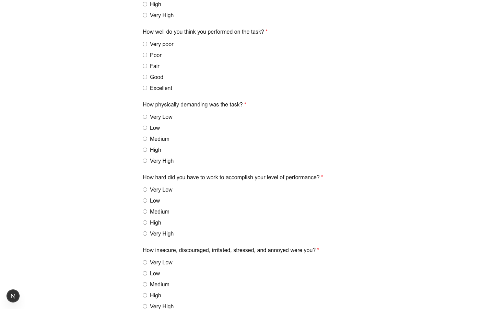

```bash
rodney js "window.scrollTo(0, document.body.scrollHeight)" && rodney sleep 1 && rodney screenshot -w 1440 -h 900 walkthroughs/walkthrough-post-survey-bottom.png
```

```output
null
walkthroughs/walkthrough-post-survey-bottom.png
```

```bash {image}
walkthroughs/walkthrough-post-survey-bottom.png
```

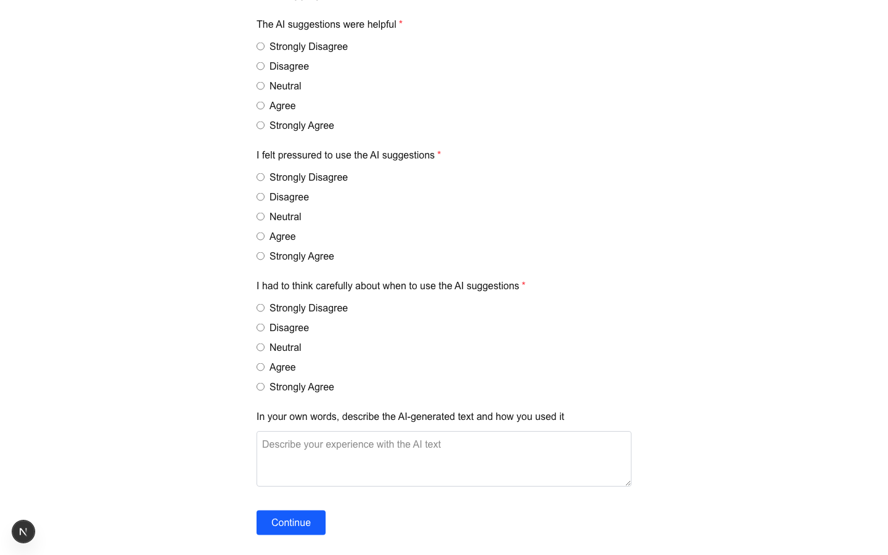

Let's fill in the post-task survey as a sample participant.

```bash
rodney click 'input[name="tlx_mental_demand"][value="Medium"]' && rodney click 'input[name="tlx_temporal_demand"][value="Low"]' && rodney click 'input[name="tlx_performance"][value="Good"]' && rodney click 'input[name="tlx_physical_demand"][value="Very Low"]' && rodney click 'input[name="tlx_effort"][value="Medium"]' && rodney click 'input[name="tlx_frustration"][value="Low"]' && echo "TLX questions filled"
```

```output
Clicked
Clicked
Clicked
Clicked
Clicked
Clicked
TLX questions filled
```

```bash
rodney click 'input[name="ai_ease_understand"][value="Agree"]' && rodney click 'input[name="ai_helpful"][value="Agree"]' && rodney click 'input[name="ai_felt_pressured"][value="Disagree"]' && rodney click 'input[name="ai_think_carefully"][value="Agree"]' && echo "AI questions filled"
```

```output
Clicked
Clicked
Clicked
Clicked
AI questions filled
```

```bash
rodney click 'input[value="None"]' && echo "Other tools: None"
```

```output
Clicked
Other tools: None
```

```bash
rodney js "window.scrollTo(0, 0)" && rodney sleep 1 && rodney screenshot -w 1440 -h 900 walkthroughs/walkthrough-post-survey-filled-top.png
```

```output
null
walkthroughs/walkthrough-post-survey-filled-top.png
```

```bash {image}
walkthroughs/walkthrough-post-survey-filled-top.png
```

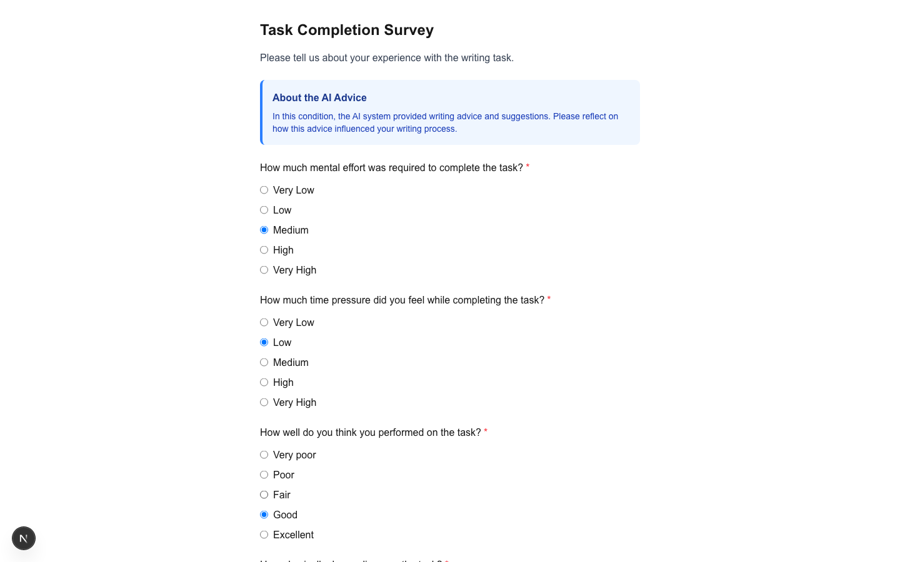

```bash
rodney js "window.scrollTo(0, document.body.scrollHeight)" && rodney sleep 1 && rodney screenshot -w 1440 -h 900 walkthroughs/walkthrough-post-survey-filled-bottom.png
```

```output
null
walkthroughs/walkthrough-post-survey-filled-bottom.png
```

```bash {image}
walkthroughs/walkthrough-post-survey-filled-bottom.png
```


The post-task survey includes both general workload questions (NASA TLX) and condition-specific AI questions. For the **p** condition, participants reflect on the directive advice: whether it was easy to understand, helpful, and whether they felt pressured to follow it. The participant clicks "Continue" to submit.

```bash
rodney click 'button[type="submit"]' && rodney sleep 2 && rodney url
```

```output
Clicked
http://localhost:3000/study?username=walkthrough-user&condition=p&scenario=roomDoubleBooking&page=final
```

## Step 8: Final Page

The study is complete. The participant sees a thank-you message and, if recruited via Prolific, a completion code for payment.

```bash
rodney screenshot -w 1440 -h 900 walkthroughs/walkthrough-final.png
```

```output
walkthroughs/walkthrough-final.png
```

```bash {image}
walkthroughs/walkthrough-final.png
```

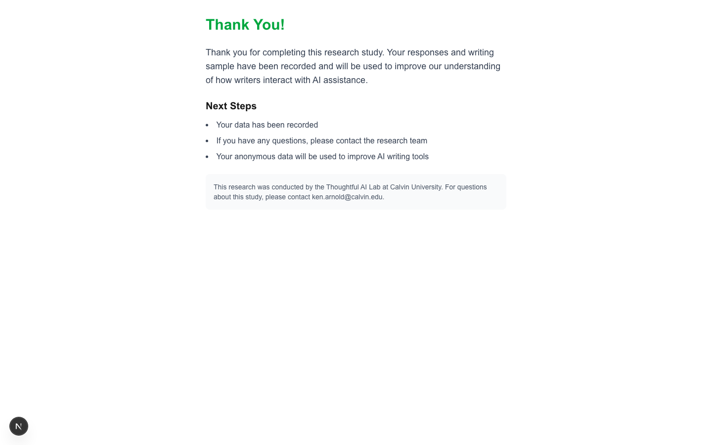

```bash
rodney text "body" 2>/dev/null | head -20
```

```output
Thank You!

Thank you for completing this research study. Your responses and writing sample have been recorded and will be used to improve our understanding of how writers interact with AI assistance.

Next Steps
Your data has been recorded
If you have any questions, please contact the research team
Your anonymous data will be used to improve AI writing tools

This research was conducted by the Thoughtful AI Lab at Calvin University. For questions about this study, please contact ken.arnold@calvin.edu.
```

## Summary

The **proposal_advice (p)** condition walkthrough is complete. The participant experienced:

1. **Consent** — Study information and IRB consent form
2. **Introduction** — Overview of the three study phases
3. **Intro Survey** — Five pages: demographics, email writing experience, AI writing tool usage, writing self-efficacy, and Need for Cognition
4. **Task Instructions** — Scenario briefing (room double-booking, email to Jaden Thompson)
5. **Main Task** — Email composition with:
   - Chat with non-proactive colleague Sarah Martinez
   - AI Writing Assistant providing **directive advice** (not copy-paste text)
   - Auto-refreshing suggestions every 15 seconds
6. **Task Complete** — Confirmation page before the post-task survey
7. **Post-Task Survey** — Workload assessment + AI-specific reflection questions
8. **Completion** — Thank you and Prolific code

The key feature of the **p** condition: AI advice guides *thinking* rather than *writing*. Suggestions like "Add the building name for Room 14" and "End with a confirmation request" prompt deeper engagement without providing verbatim text to copy.

```bash
rodney stop
```

```output
Chrome stopped
```
